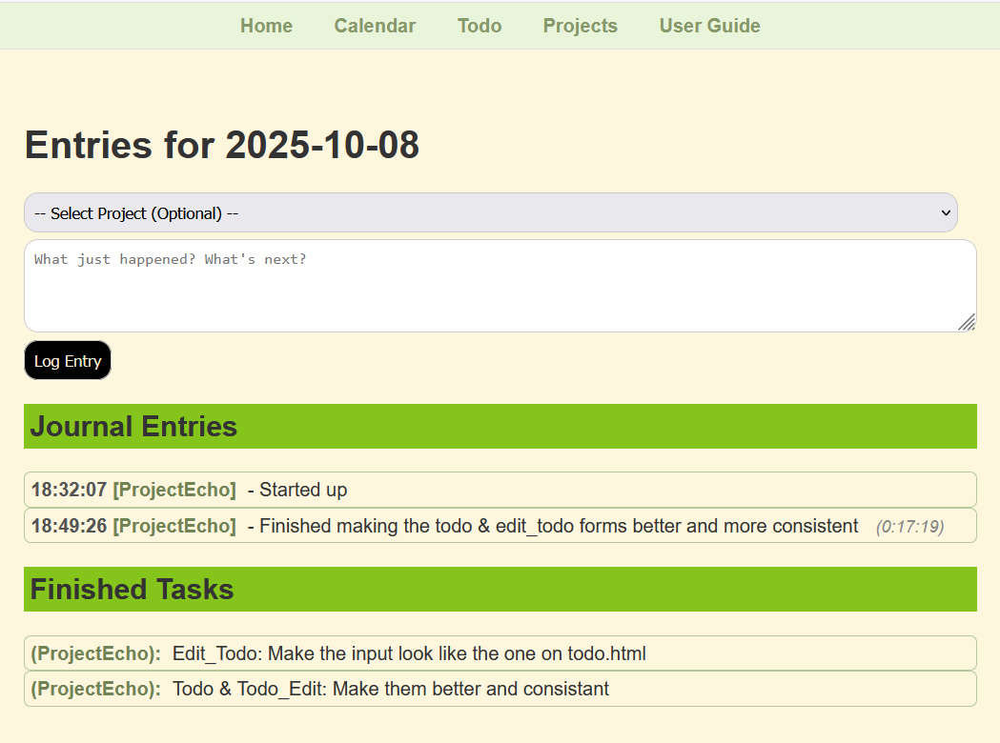
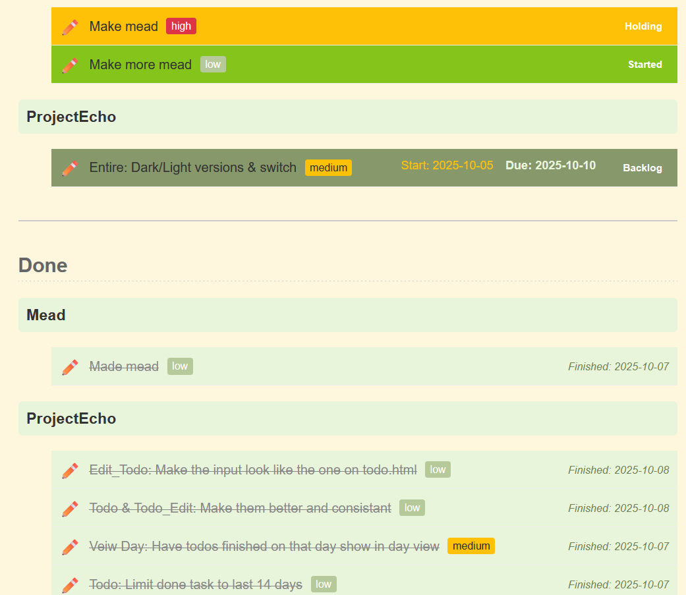

# Project Echo - WIP

Interstitial Journaling app. Mostly, I need a better way to track what I am working on at work, and this concept looked interesting. 

reference: https://nesslabs.com/interstitial-journaling

## Features added:

* Show elapsed time since last entry on the same date. 
* Re order date/time, so that the most newest date is at the top, and the oldest time is at top.
* Allow for editing of entries.
* Make dates collapsible
* Enter time stamped data
* Create a calendar that will let me click on a date and see all the entries for that date. 
* Home page entries need to have a project entry.
* Limit what entries show in the past to just the last 14 dates. 
* Limit what finished todos show in the past to just the last 31 dates. Should make monthly "What did you do" reports easier.
* Finished todos show up on the day view that they were finished.
* Project page to control project names, so I can use the data to feed dropdowns for entries & todos. 
* Added past/future months for Calender
* Implemented markdown type formating in entries 
* User Guide
* Start & Due date show on unfinished todos

## Plans for the future: 

* Maybe figure out a way to have it make me enter a goal list for the day  
* Add markdown type formating to todos

### Home page

### Calendar page

### Day page

### Edit page

### Todo page

### User Guide page

### Projects page
