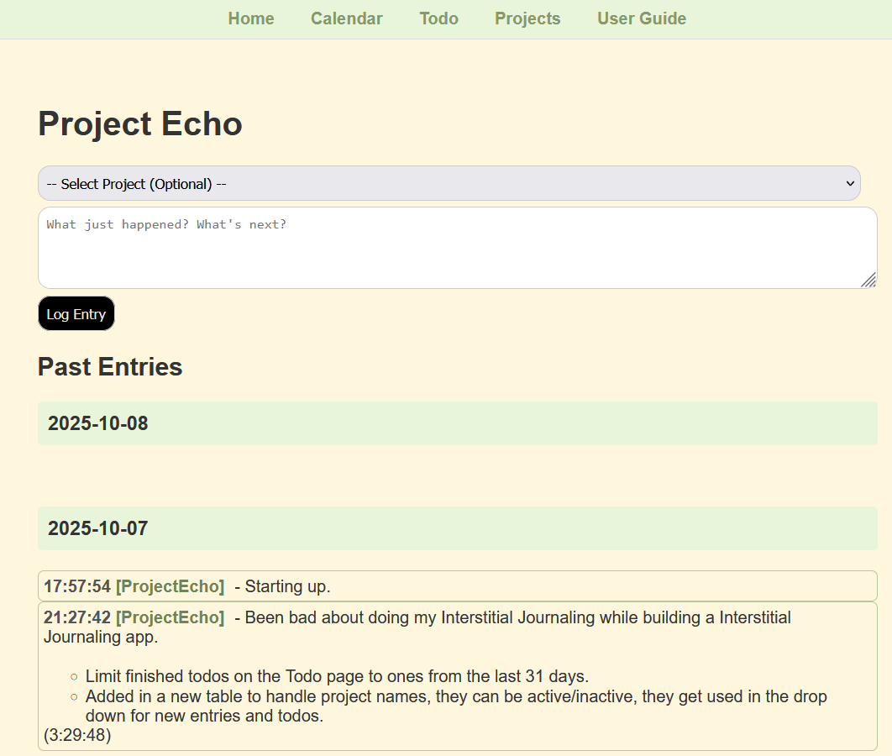
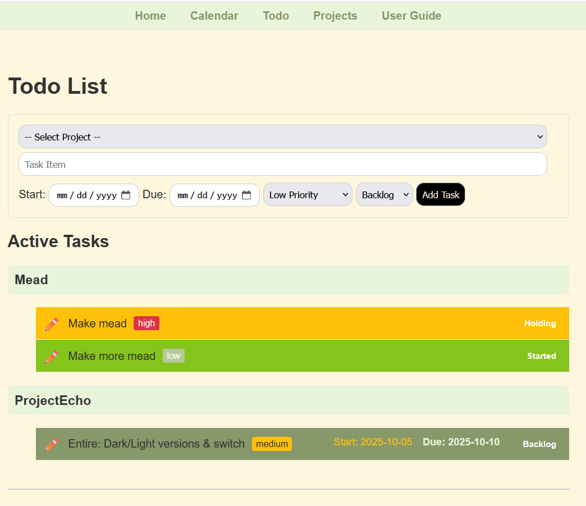

# Project Echo - WIP

Interstitial Journaling app. Mostly, I need a better way to track what I am working on at work, and this concept looked interesting. 

reference: https://nesslabs.com/interstitial-journaling

## Features added:

* Show elapsed time since last entry on the same date. 
* Re order date/time, so that the most newest date is at the top, and the oldest time is at top.
* Allow for editing of entries.
* Make dates collapse
* Enter time stamped data
* Create a calendar that will let me click on a date and see all the entries for that date. 
* Have it show me how long between entries
* Home page entries need to have a project entry.
## Plans for the future: 

* Limit what shows in the past to just the last 14 dates. 
* Maybe figure out a way to have it make me enter a goal list for the day  

### Home page

### Calendar page

### Day page

### Edit page

### Todo page

